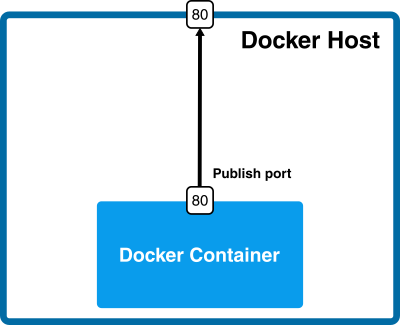

Docker Networks
===============

Most applications today do not run in isolation. They need to communicate with other systems. If we want to run a website, a service or a database inside a Docker container, we first need to understand how to run a service and expose its ports to other applications.

Let's start with a simple example, and run an Nginx server:

```bash
$ docker run nginx
/docker-entrypoint.sh: /docker-entrypoint.d/ is not empty, will attempt to perform configuration
/docker-entrypoint.sh: Looking for shell scripts in /docker-entrypoint.d/
/docker-entrypoint.sh: Launching /docker-entrypoint.d/10-listen-on-ipv6-by-default.sh
10-listen-on-ipv6-by-default.sh: info: Getting the checksum of /etc/nginx/conf.d/default.conf
10-listen-on-ipv6-by-default.sh: info: Enabled listen on IPv6 in /etc/nginx/conf.d/default.conf
/docker-entrypoint.sh: Launching /docker-entrypoint.d/20-envsubst-on-templates.sh
/docker-entrypoint.sh: Launching /docker-entrypoint.d/30-tune-worker-processes.sh
/docker-entrypoint.sh: Configuration complete; ready for start up
```
We can see the logs in the console and we know it is running. 

Nginx is a web application server whose user interface is accessible by default through port 80. Therefore, if we were to install Nginx on our machine, we could browse it at http://localhost:80. In our case, however, Nginx is running inside the Docker container.

<p align="center">

</p>


This is because Nginx has been started inside the container and we are trying to reach it from the outside. How can we make the running Nginx accessible from the outside?

Let's start a new Nginx container by publishing port 80:

```bash
$ docker run -p 80:80  nginx
/docker-entrypoint.sh: /docker-entrypoint.d/ is not empty, will attempt to perform configuration
/docker-entrypoint.sh: Looking for shell scripts in /docker-entrypoint.d/
/docker-entrypoint.sh: Launching /docker-entrypoint.d/10-listen-on-ipv6-by-default.sh
10-listen-on-ipv6-by-default.sh: info: Getting the checksum of /etc/nginx/conf.d/default.conf
10-listen-on-ipv6-by-default.sh: info: Enabled listen on IPv6 in /etc/nginx/conf.d/default.conf
/docker-entrypoint.sh: Launching /docker-entrypoint.d/20-envsubst-on-templates.sh
/docker-entrypoint.sh: Launching /docker-entrypoint.d/30-tune-worker-processes.sh
/docker-entrypoint.sh: Configuration complete; ready for start up
```

After a few seconds Nignx should have started and you should be able to access its welcome page via http://localhost:80:

<p align="center">

</p>

This simple port mapping is sufficient for many common container use cases. We can then deploy a large number of services as Docker containers and expose their ports to facilitate communication.

Check the diagram below:

<p align="center">

</p>

Container networks
==================

We have connected to the application running inside the container. In fact, the connection is bidirectional and we could, for example, run *apt install* commands from inside the running Nginx container and the packages would be downloaded from the Internet. How is this possible?

If you check the network interfaces of your machine, you will see that one of the interfaces is called **docker0**:

```bash
$ ifconfig
… 
docker0 Link encap:Ethernet HWaddr 02:42:db:d0:47:db
inet addr:172.17.0.1 Bcast:0.0.0.0 Mask:255.255.0.0
…
```

The **docker0 interface** is created by the **Docker daemon** to connect to containers. We can see which network interfaces are created inside the container by using the *inspect* command.

Let's stop all possible containers and start a new Nginx container.


```bash
$ docker stop $(docker ps -a -q)

$ docker run -d -p 80:80 nginx
ffa42d8d5fc9cf9f34e8e8389c79dc5c8b82797d7a43db806976d0cf8beaa1c8

$ docker inspect ffa4
```

This prints out all the information about the container configuration in JSON format. And among others, we can find the section of the network configuration section:

```json
…
"Networks": {
                "bridge": {
                    "IPAMConfig": null,
                    "Links": null,
                    "Aliases": null,
                    "NetworkID": "417776023b2da5ceb48eb160fd9ca0479862782d01518cad2ba8dbcbbd9e9ed4",
                    "EndpointID": "c38d0f5f7d593cb8e63b825e4fd29963095f0a83b2175c83294c6108a43c0ce3",
                    "Gateway": "172.17.0.1",
                    "IPAddress": "172.17.0.2",
                    "IPPrefixLen": 16,
                    "IPv6Gateway": "",
                    "GlobalIPv6Address": "",
                    "GlobalIPv6PrefixLen": 0,
                    "MacAddress": "02:42:ac:11:00:02",
                    "DriverOpts": null
                }
```

We can see that the container has an IP of 172.17.0.2 and communicates with the host via IP 172.17.0.1. This means that in our example above, we could access the Nginx server even without port mapping using http://172.17.0.2:80. 

<p align="center">

</p>
&nbsp;&nbsp;
 


Docker networks in more detail
==============================


A container can communicate directly with the outside world, but in order for the outside world to communicate with a container, it is necessary to communicate via the host server interface usually called **eth0**.

A Docker installation usually has 3 default networks: **Bridge**, **Host**, and **None**. Let's look at this using the following command:

```bash
$ docker network ls
NETWORK ID     NAME      DRIVER    SCOPE
3143420cfe08   bridge    bridge    local
999e2e3eac57   host      host      local
dce9e1997400   none      null      local
```

Let's look at each of these networks as well as the mechanisms that allow interaction with them.


Bridge
------

This is the simplest type that Docker offers and is the one you've been using from the beginning without even knowing it. Let's create a container to see what's going on inside.

```bash
$ docker run -dit ubuntu
0d54b434e79262138dbb00f5cb9ce85576fa5493408c74078d5799609a7a73f5
$ docker inspect 0d54
```

```json
…
"Networks": {
                "bridge": {
                    "IPAMConfig": null,
                    "Links": null,
                    "Aliases": null,
                    "NetworkID": "5126d7b5f29feb30056a83f52360e074842ae2cd85663a97d1e872e71a9e130d",
                    "EndpointID": "dfee868a4bcc632bb9ead427a529b1169a6826fd2d0e796f45c675a6dd8ae8c5",
                    "Gateway": "172.17.0.1",
                    "IPAddress": "172.17.0.2",
                    "IPPrefixLen": 16,
                    "IPv6Gateway": "",
                    "GlobalIPv6Address": "",
                    "GlobalIPv6PrefixLen": 0,
                    "MacAddress": "02:42:ac:11:00:02",
                    "DriverOpts": null
                }
```

The container has an IP address of 172.17.0.2. This IP address is generated by the Docker IP address management system also known as **IPAM**. Normally, the first IP address in this series, i.e. 172.17.0.1, will be assigned to the **docker0** bridge and the broadcast IP will be 172.17.255.255. All IPs between these two IPs are assignable to containers.

The **docker0** bridge is the default one that connects the container ports to eth0.

Let's see how. To do this, let's run this command on the host:

```bash
$ ip addr
1: lo: <LOOPBACK,UP,LOWER_UP> mtu 65536 qdisc noqueue state UNKNOWN group default qlen 1000
    link/loopback 00:00:00:00:00:00 brd 00:00:00:00:00:00
    inet 127.0.0.1/8 scope host lo
       valid_lft forever preferred_lft forever
    inet6 ::1/128 scope host
       valid_lft forever preferred_lft forever
2: eth0: <BROADCAST,MULTICAST,UP,LOWER_UP> mtu 9001 qdisc fq_codel state UP group default qlen 1000
    link/ether 0a:4b:6f:44:89:9b brd ff:ff:ff:ff:ff:ff
    inet 172.31.18.82 brd 172.31.31.255 scope global dynamic eth0
       valid_lft 2394sec preferred_lft 2394sec
    inet6 fe80::84b:6fff:fe44:899b/64 scope link
       valid_lft forever preferred_lft forever
3: docker0: <BROADCAST,MULTICAST,UP,LOWER_UP> mtu 1500 qdisc noqueue state UP group default
    link/ether 02:42:21:fb:dc:5d brd ff:ff:ff:ff:ff:ff
    inet 172.17.0.1/16 brd 172.17.255.255 scope global docker0
       valid_lft forever preferred_lft forever
    inet6 fe80::42:21ff:fefb:dc5d/64 scope link
       valid_lft forever preferred_lft forever
19: veth3fc36ad@if18: <BROADCAST,MULTICAST,UP,LOWER_UP> mtu 1500 qdisc noqueue master docker0 state UP group default
    link/ether 02:78:fc:b1:56:ad brd ff:ff:ff:ff:ff:ff link-netnsid 0
    inet6 fe80::78:fcff:feb1:56ad/64 scope link
       valid_lft forever preferred_lft forever
```

Among other interfaces, there is a *veth* (Virtual Ethernet Interface) that connects the container to **docker0** and has the name **vethf8eafcc@if5**. The other end of **docker0** is connected to the host system on **eth0**.  The diagram of how the network works so far is as follows:

<p align="center">

</p>
