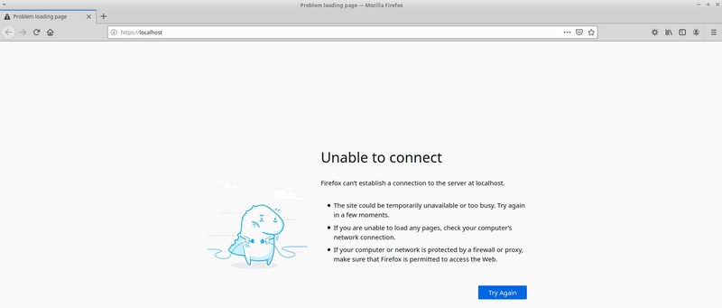
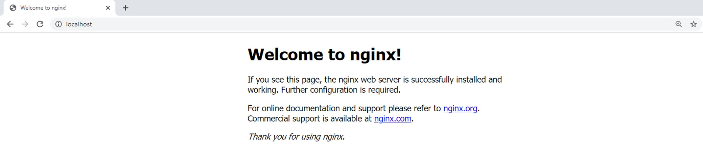
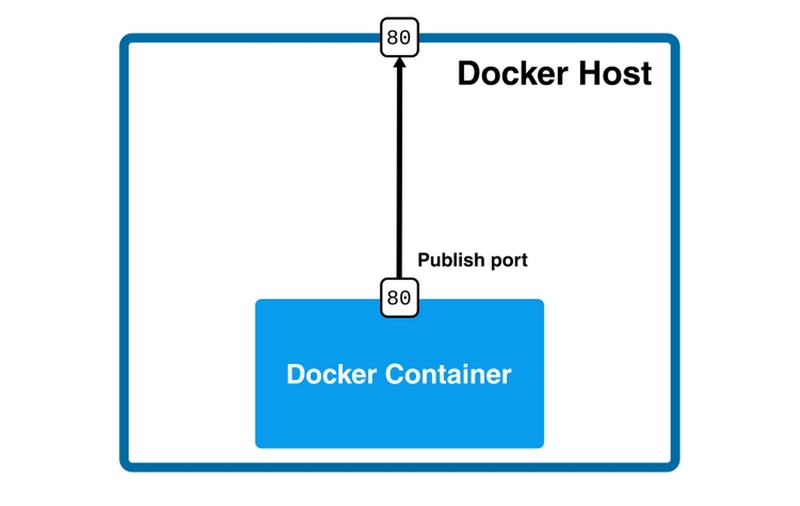

Docker Networks
===============

Most applications today do not run in isolation. They need to communicate with other systems. If we want to run a website, a service or a database inside a Docker container, we first need to understand how to run a service and expose its ports to other applications.

Let's start with a simple example, and run an Nginx server:

```bash
$ docker run nginx
/docker-entrypoint.sh: /docker-entrypoint.d/ is not empty, will attempt to perform configuration
/docker-entrypoint.sh: Looking for shell scripts in /docker-entrypoint.d/
/docker-entrypoint.sh: Launching /docker-entrypoint.d/10-listen-on-ipv6-by-default.sh
10-listen-on-ipv6-by-default.sh: info: Getting the checksum of /etc/nginx/conf.d/default.conf
10-listen-on-ipv6-by-default.sh: info: Enabled listen on IPv6 in /etc/nginx/conf.d/default.conf
/docker-entrypoint.sh: Launching /docker-entrypoint.d/20-envsubst-on-templates.sh
/docker-entrypoint.sh: Launching /docker-entrypoint.d/30-tune-worker-processes.sh
/docker-entrypoint.sh: Configuration complete; ready for start up
```
We can see the logs in the console and we know it is running. 

Nginx is a web application server whose user interface is accessible by default through port 80. Therefore, if we were to install Nginx on our machine, we could browse it at http://localhost:80. In our case, however, Nginx is running inside the Docker container.

<p align="center">

</p>


This is because Nginx has been started inside the container and we are trying to reach it from the outside. How can we make the running Nginx accessible from the outside?

Let's start a new Nginx container by publishing port 80:

```bash
$ docker run -p 80:80  nginx
/docker-entrypoint.sh: /docker-entrypoint.d/ is not empty, will attempt to perform configuration
/docker-entrypoint.sh: Looking for shell scripts in /docker-entrypoint.d/
/docker-entrypoint.sh: Launching /docker-entrypoint.d/10-listen-on-ipv6-by-default.sh
10-listen-on-ipv6-by-default.sh: info: Getting the checksum of /etc/nginx/conf.d/default.conf
10-listen-on-ipv6-by-default.sh: info: Enabled listen on IPv6 in /etc/nginx/conf.d/default.conf
/docker-entrypoint.sh: Launching /docker-entrypoint.d/20-envsubst-on-templates.sh
/docker-entrypoint.sh: Launching /docker-entrypoint.d/30-tune-worker-processes.sh
/docker-entrypoint.sh: Configuration complete; ready for start up
```

After a few seconds Nignx should have started and you should be able to access its welcome page via http://localhost:80:



This simple port mapping is sufficient for many common container use cases. We can then deploy a large number of services as Docker containers and expose their ports to facilitate communication.

Check the diagram below:



Container networks
==================

We have connected to the application running inside the container. In fact, the connection is bidirectional and we could, for example, run *apt install* commands from inside the running Nginx container and the packages would be downloaded from the Internet. How is this possible?

If you check the network interfaces of your machine, you will see that one of the interfaces is called **docker0**:

```bash
$ ifconfig
… 
docker0 Link encap:Ethernet HWaddr 02:42:db:d0:47:db
inet addr:172.17.0.1 Bcast:0.0.0.0 Mask:255.255.0.0
…
```

The **docker0 interface** is created by the **Docker daemon** to connect to containers. We can see which network interfaces are created inside the container by using the *inspect* command.

Let's stop all possible containers and start a new Nginx container.
