Docker Networks
===============

Most applications today do not run in isolation. They need to communicate with other systems. If we want to run a website, a service or a database inside a Docker container, we first need to understand how to run a service and expose its ports to other applications.

Let's start with a simple example, and run an Nginx server:

```bash
$ docker run nginx
/docker-entrypoint.sh: /docker-entrypoint.d/ is not empty, will attempt to perform configuration
/docker-entrypoint.sh: Looking for shell scripts in /docker-entrypoint.d/
/docker-entrypoint.sh: Launching /docker-entrypoint.d/10-listen-on-ipv6-by-default.sh
10-listen-on-ipv6-by-default.sh: info: Getting the checksum of /etc/nginx/conf.d/default.conf
10-listen-on-ipv6-by-default.sh: info: Enabled listen on IPv6 in /etc/nginx/conf.d/default.conf
/docker-entrypoint.sh: Launching /docker-entrypoint.d/20-envsubst-on-templates.sh
/docker-entrypoint.sh: Launching /docker-entrypoint.d/30-tune-worker-processes.sh
/docker-entrypoint.sh: Configuration complete; ready for start up
```
We can see the logs in the console and we know it is running. 

Nginx is a web application server whose user interface is accessible by default through port 80. Therefore, if we were to install Nginx on our machine, we could browse it at http://localhost:80. In our case, however, Nginx is running inside the Docker container.

<p align="center">
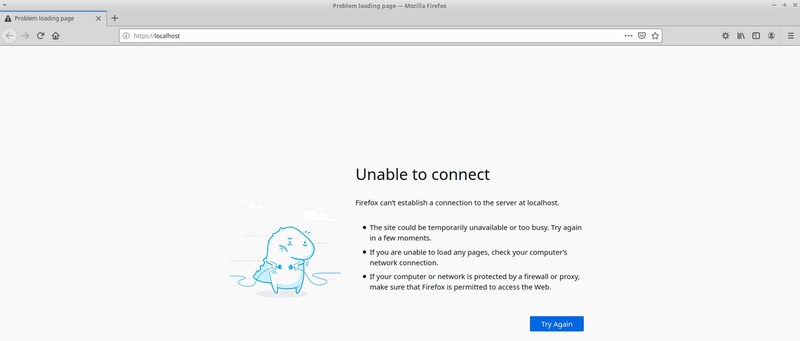
</p>


This is because Nginx has been started inside the container and we are trying to reach it from the outside. How can we make the running Nginx accessible from the outside?

Let's start a new Nginx container by publishing port 80:

```bash
$ docker run -p 80:80  nginx
/docker-entrypoint.sh: /docker-entrypoint.d/ is not empty, will attempt to perform configuration
/docker-entrypoint.sh: Looking for shell scripts in /docker-entrypoint.d/
/docker-entrypoint.sh: Launching /docker-entrypoint.d/10-listen-on-ipv6-by-default.sh
10-listen-on-ipv6-by-default.sh: info: Getting the checksum of /etc/nginx/conf.d/default.conf
10-listen-on-ipv6-by-default.sh: info: Enabled listen on IPv6 in /etc/nginx/conf.d/default.conf
/docker-entrypoint.sh: Launching /docker-entrypoint.d/20-envsubst-on-templates.sh
/docker-entrypoint.sh: Launching /docker-entrypoint.d/30-tune-worker-processes.sh
/docker-entrypoint.sh: Configuration complete; ready for start up
```

After a few seconds Nignx should have started and you should be able to access its welcome page via http://localhost:80:

<p align="center">
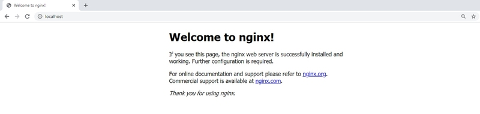
</p>

This simple port mapping is sufficient for many common container use cases. We can then deploy a large number of services as Docker containers and expose their ports to facilitate communication.

Check the diagram below:

<p align="center">
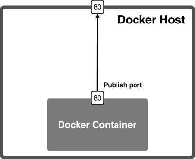
</p>

Container networks
==================

We have connected to the application running inside the container. In fact, the connection is bidirectional and we could, for example, run *apt install* commands from inside the running Nginx container and the packages would be downloaded from the Internet. How is this possible?

If you check the network interfaces of your machine, you will see that one of the interfaces is called **docker0**:

```bash
$ ifconfig
… 
docker0 Link encap:Ethernet HWaddr 02:42:db:d0:47:db
inet addr:172.17.0.1 Bcast:0.0.0.0 Mask:255.255.0.0
…
```

The **docker0 interface** is created by the **Docker daemon** to connect to containers. We can see which network interfaces are created inside the container by using the *inspect* command.

Let's stop all possible containers and start a new Nginx container.


```bash
$ docker stop $(docker ps -a -q)

$ docker run -d -p 80:80 nginx
ffa42d8d5fc9cf9f34e8e8389c79dc5c8b82797d7a43db806976d0cf8beaa1c8

$ docker inspect ffa4
```

This prints out all the information about the container configuration in JSON format. And among others, we can find the section of the network configuration section:

```json
…
"Networks": {
                "bridge": {
                    "IPAMConfig": null,
                    "Links": null,
                    "Aliases": null,
                    "NetworkID": "417776023b2da5ceb48eb160fd9ca0479862782d01518cad2ba8dbcbbd9e9ed4",
                    "EndpointID": "c38d0f5f7d593cb8e63b825e4fd29963095f0a83b2175c83294c6108a43c0ce3",
                    "Gateway": "172.17.0.1",
                    "IPAddress": "172.17.0.2",
                    "IPPrefixLen": 16,
                    "IPv6Gateway": "",
                    "GlobalIPv6Address": "",
                    "GlobalIPv6PrefixLen": 0,
                    "MacAddress": "02:42:ac:11:00:02",
                    "DriverOpts": null
                }
```

We can see that the container has an IP of 172.17.0.2 and communicates with the host via IP 172.17.0.1. This means that in our example above, we could access the Nginx server even without port mapping using http://172.17.0.2:80. 

<p align="center">
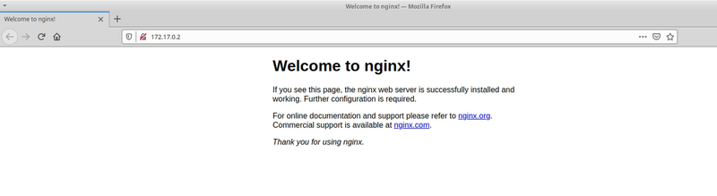
</p>
&nbsp;&nbsp;
 


Docker networks in more detail
==============================


A container can communicate directly with the outside world, but in order for the outside world to communicate with a container, it is necessary to communicate via the host server interface usually called **eth0**.

A Docker installation usually has 3 default networks: **Bridge**, **Host**, and **None**. Let's look at this using the following command:

```bash
$ docker network ls
NETWORK ID     NAME      DRIVER    SCOPE
3143420cfe08   bridge    bridge    local
999e2e3eac57   host      host      local
dce9e1997400   none      null      local
```

Let's look at each of these networks as well as the mechanisms that allow interaction with them.


Bridge
------

This is the simplest type that Docker offers and is the one you've been using from the beginning without even knowing it. Let's create a container to see what's going on inside.

```bash
$ docker run -dit ubuntu
0d54b434e79262138dbb00f5cb9ce85576fa5493408c74078d5799609a7a73f5
$ docker inspect 0d54
```

```json
…
"Networks": {
                "bridge": {
                    "IPAMConfig": null,
                    "Links": null,
                    "Aliases": null,
                    "NetworkID": "5126d7b5f29feb30056a83f52360e074842ae2cd85663a97d1e872e71a9e130d",
                    "EndpointID": "dfee868a4bcc632bb9ead427a529b1169a6826fd2d0e796f45c675a6dd8ae8c5",
                    "Gateway": "172.17.0.1",
                    "IPAddress": "172.17.0.2",
                    "IPPrefixLen": 16,
                    "IPv6Gateway": "",
                    "GlobalIPv6Address": "",
                    "GlobalIPv6PrefixLen": 0,
                    "MacAddress": "02:42:ac:11:00:02",
                    "DriverOpts": null
                }
```

The container has an IP address of 172.17.0.2. This IP address is generated by the Docker IP address management system also known as **IPAM**. Normally, the first IP address in this series, i.e. 172.17.0.1, will be assigned to the **docker0** bridge and the broadcast IP will be 172.17.255.255. All IPs between these two IPs are assignable to containers.

The **docker0** bridge is the default one that connects the container ports to eth0.

Let's see how. To do this, let's run this command on the host:

```bash
$ ip addr
1: lo: <LOOPBACK,UP,LOWER_UP> mtu 65536 qdisc noqueue state UNKNOWN group default qlen 1000
    link/loopback 00:00:00:00:00:00 brd 00:00:00:00:00:00
    inet 127.0.0.1/8 scope host lo
       valid_lft forever preferred_lft forever
    inet6 ::1/128 scope host
       valid_lft forever preferred_lft forever
2: eth0: <BROADCAST,MULTICAST,UP,LOWER_UP> mtu 9001 qdisc fq_codel state UP group default qlen 1000
    link/ether 0a:4b:6f:44:89:9b brd ff:ff:ff:ff:ff:ff
    inet 172.31.18.82 brd 172.31.31.255 scope global dynamic eth0
       valid_lft 2394sec preferred_lft 2394sec
    inet6 fe80::84b:6fff:fe44:899b/64 scope link
       valid_lft forever preferred_lft forever
3: docker0: <BROADCAST,MULTICAST,UP,LOWER_UP> mtu 1500 qdisc noqueue state UP group default
    link/ether 02:42:21:fb:dc:5d brd ff:ff:ff:ff:ff:ff
    inet 172.17.0.1/16 brd 172.17.255.255 scope global docker0
       valid_lft forever preferred_lft forever
    inet6 fe80::42:21ff:fefb:dc5d/64 scope link
       valid_lft forever preferred_lft forever
19: veth3fc36ad@if18: <BROADCAST,MULTICAST,UP,LOWER_UP> mtu 1500 qdisc noqueue master docker0 state UP group default
    link/ether 02:78:fc:b1:56:ad brd ff:ff:ff:ff:ff:ff link-netnsid 0
    inet6 fe80::78:fcff:feb1:56ad/64 scope link
       valid_lft forever preferred_lft forever
```

Among other interfaces, there is a *veth* (Virtual Ethernet Interface) that connects the container to **docker0** and has the name **vethf8eafcc@if5**. The other end of **docker0** is connected to the host system on **eth0**.  The diagram of how the network works so far is as follows:

<p align="center">
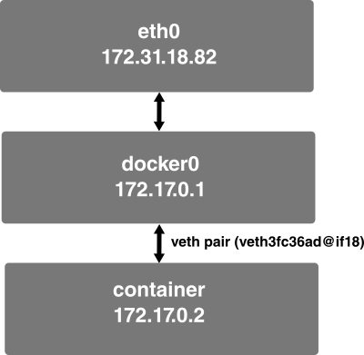
</p>


All traffic will flow through the eth0 interface and then be routed to the respective containers via docker0. 

Let's see how the containers communicate with each other over a bridge network. To do so, let's create two containers:

```bash
$ docker run -dit --name container_1 ubuntu
$ docker run -dit --name container_2 ubuntu
```

If we now inspect the bridge network, we will see that there is a section called Containers where we can see the two we have running:

```bash
$ docker network inspect bridge
```

```json
...
        "Containers": {
            "025f6cdac52aaef9bf10c38f870fc5597cc848ac76487cdd36aff8da8321fe30": {
                "Name": "container_2",
                "EndpointID": "3ca4207329947cc9ada99cb1e99d75af2a97700882b09fb6c46b521bbee32b95",
                "MacAddress": "02:42:ac:11:00:04",
                "IPv4Address": "172.17.0.4/16",
                "IPv6Address": ""
            },
            "cf2d53fead4200cc4e0e5e27673f1bfc659978a21be9db3187bfc6593fa388ef": {
                "Name": "container_1",
                "EndpointID": "c627760c506cfee73a53514dfa34de113d2aa691e3c229336c525b0089ef8b68",
                "MacAddress": "02:42:ac:11:00:03",
                "IPv4Address": "172.17.0.3/16",
                "IPv6Address": ""
            }
        },
        "Options": ...
```

As you can see, there are the two containers, with IPs 172.17.0.4 and 172.17.0.3, which indicates that they are in the same range and could communicate with each other. 
Try sending a ping from **container_1** to **container_2**:

```bash
$ docker attach container_1
root@cf2d53fead42:/# ping -c 2 172.17.0.4
```

And the result should be something like:

```bash
PING 172.17.0.3 (172.17.0.4): 56 data bytes
64 bytes from 172.17.0.4: seq=0 ttl=64 time=0.723 ms
64 bytes from 172.17.0.4: seq=1 ttl=64 time=0.069 ms

--- 172.17.0.4 ping statistics ---
2 packets transmitted, 2 packets received, 0% packet loss
round-trip min/avg/max = 0.069/0.396/0.723 ms
```

However, each time we create this container this IP can be different, as these IPs are not reserved for containers at all. This can be a problem if several containers communicate with each other and we want to add this information as part of our application. 

Docker allows us to communicate containers via their name rather than their IP. However, in this default generated bridge network it is not possible to use this mechanism. In fact, if we try it we will see that the containers in this network are not recognised by name:
 
```bash
root@cf2d53fead42:/# ping -c 2 container_2
ping: bad address 'container_2'
```

To do so, we must create our own networks.

How to create our own networks
==============================

Creating a network in Docker is as simple as:

```bash
$ docker network create my_bridge
97ac278b6d1ad67d116bc60c355dca81f1a7b6e22cfc7730252def6dd3b6eb79
```

Once created, if you go back to the list of available networks on your host, you will see that you have a new one, called **my_bridge**, which uses the bridge driver.

```bash
$ docker network ls
NETWORK ID     NAME         DRIVER    SCOPE
5400f00b0ff6   bridge       bridge    local
b8091a21ae4c   host         host      local
97ac278b6d1a   my_bridge    bridge    local
84b2f783c5d0   none         null      local
```

Let's create now two ubuntu containers, named **container_a** and **container_b** inside the network we just created. Finally let's ping from one of them to the other using their names.

```bash
$ docker container run -dit --name container_a --network my_bridge ubuntu
$ docker container run -dit --name container_b --network my_bridge ubuntu
$ docker attach container_b
root@ecd6265aafd0:/# ping -c 3 container_a
PING container_a (172.18.0.2): 56 data bytes
64 bytes from 172.18.0.2: seq=0 ttl=64 time=0.131 ms
64 bytes from 172.18.0.2: seq=1 ttl=64 time=0.106 ms
64 bytes from 172.18.0.2: seq=2 ttl=64 time=0.118 ms

--- container_a ping statistics ---
3 packets transmitted, 3 packets received, 0% packet loss
round-trip min/avg/max = 0.106/0.118/0.131 ms
/ #
```

Docker uses a DNS server configured for each container that allows them to resolve the name of the other containers with which they share a network.


Host
====

Another network listed on your local machine is called host. What this network does is to remove the isolation between the host and the containers, so a container does not receive its own IP, as we saw in the previous examples, but uses the host's IP. Therefore, if you run a container associated with this network listening on port 80, the container's application will be available through port 80 of the host's IP.

```bash
$ docker run -d --network host nginx
```

To check that it works, let's try to access directly through port 80 of the host.

<p align="center">
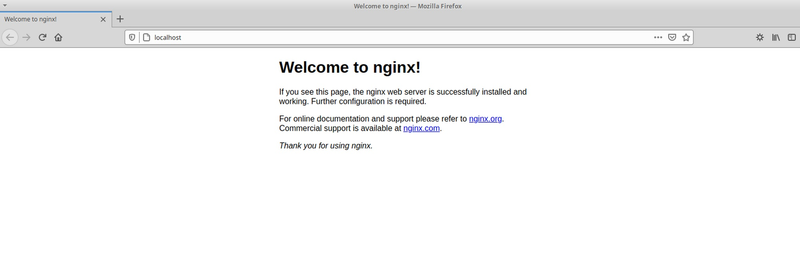
</p>

But why would we want to do that? We could use it in case we are trying to debug or analyse the traffic flowing through the host network.

None
====

In case we want a container to have no network assigned to it, we will use --network none as in the following example:

```bash
$ docker run -dit --network none ubuntu bash
98005a17c9ecf6298c4f3c378d1f44932443ce98c64a4b9441e209e7070c2424
```


This container will be completely isolated from the outside world, and applications running inside the container will be isolated from anywhere outside the container.

If you now check the networks assigned to this container, you will see that there are no values for IPAddress and Gateway.


```bash
$ docker inspect 9800
 ...
 "Networks": {
                "none": {
                    "IPAMConfig": null,
                    "Links": null,
                    "Aliases": null,
                    "NetworkID": "79666cd48e4a29b19dbc74f44aec690215f582db84c786ca70b94fa5c3f98ada",
                    "EndpointID": "2997b3df16b999b8b64b767a8a1f89e6af2d76c453b744365b55c7079ec78ac5",
                    "Gateway": "",
                    "IPAddress": "",
                    "IPPrefixLen": 0,
                    "IPv6Gateway": "",
                    "GlobalIPv6Address": "",
                    "GlobalIPv6PrefixLen": 0,
                    "MacAddress": "",
                    "DriverOpts": null
                }
            }
```

How to connect a container to two networks
==========================================

One question that may arise from this example is: can a container be connected to more than one network? The answer is yes, and it is very easy to do so. However, during creation it is only possible to connect to a single network. To connect to a second, third, and so on, you need to connect to an already running container via the *network connect* command:

```bash
$ docker network connect my_bridge container_1
```

If you have been running all the examples, now **container_1**, which was originally only on the default network, called **bridge**, now also belongs to the network called **my_bridge**, so it could communicate with both **container_a** and **container_b**:

```bash
$ docker attach container_1
ping -c 2 container_a
...
ping -c 2 container_b
...
```

Port mapping
============

Usually the outside world needs to communicate with the container, and can only do so when it passes through a host port. Therefore, the host port needs to be mapped to a port in the container. 

If we have followed the above sections we will have a number of containers running by now. Let's stop and delete them.

```bash
$ docker stop $(docker ps -a -q)
$ docker container prune
```

And now we are going to run 2 containers: an Nginx server and an Apache server. 

```bash
$ docker run -d -p 80:80 nginx
a5e67277a8e84441506af7367217f3c12804b388ee2027664a6e38115315c2b4
```

<p align="center">
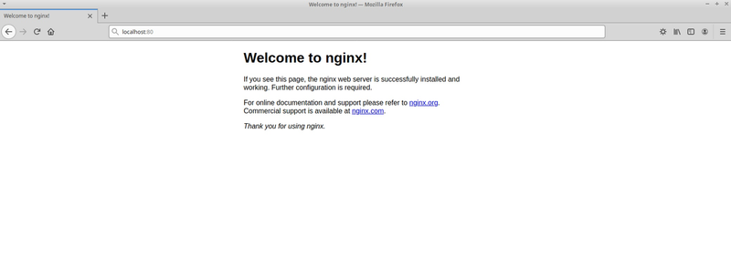
</p>

```bash
$ docker run -d -p 81:80 httpd
8c9cc29fdcede03e9cc082183fd67244d35d926addaa8bac10c3becb6cd7f530
```

<p align="center">
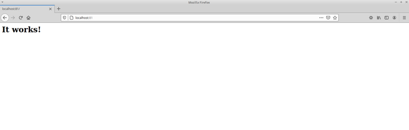
</p>

We can get an idea of how these 2 servers are working by looking at the following diagram:

<p align="center">
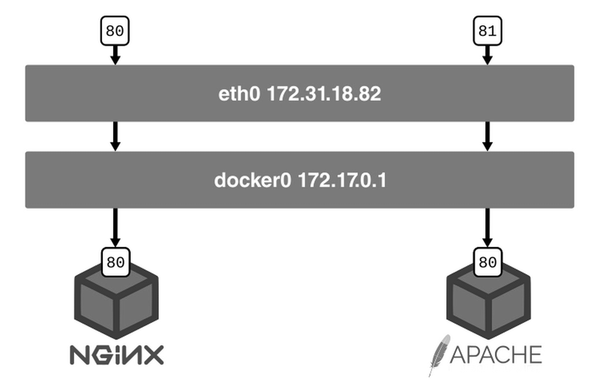
</p>


We see that port 80 of the host is mapped to port 80 of the container while port 81 of the host is mapped to port 80 of the other container. 

In this way all external traffic is routed through a host port to a container port to create a connection. Remember, however, that none of this is necessary in the reverse direction when the containers want to communicate with the outside world. 


Use of the -P and -p flags
--------------------------

By default, if you use the docker run or docker create command to run or create a container, it does not make any ports of that container accessible from the outside. So, while it is possible for your Docker containers to connect to the outside world without making any changes to your code, it is not possible for the outside world to connect to your Docker containers.

If you want to override this default behaviour, you can use the -P or -p flag in your Docker runchain. Port publishing produces a firewall rule that binds a container port to a port on the Docker host, ensuring that the ports are accessible to any client that can communicate with the host.  

This is what makes a port accessible to Docker containers that are not connected to the container network, or to services that are outside your Docker environment.
 
There are therefore two ways to publish ports in Docker:

■ Using the -P flag
■ Using the -p flag

Using the -P flag
-----------------

Using the -P flag allows you to publish all ports exposed by a container to random ports on host interfaces. It is short for -publish-all.

Let's try an example:

```bash
$ docker run -d -P nginx
9fa6fe923e9190d5e18ce90282207b420fa9e2ac390186c6b89506d8fd306a18
$ docker port 9fa6
80/tcp -> 0.0.0.0:49153
```

We see that port 80 has been automatically published to a random port, in this case 49153. 

<p align="center">
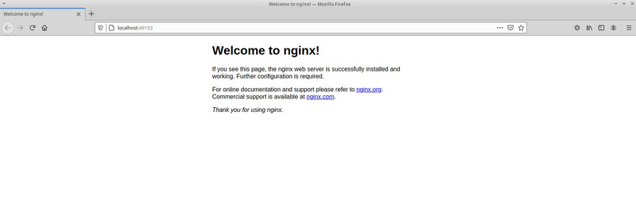
</p>

Using the -p flag
-----------------

Using the -p flag (lowercase) at runtime allows you to publish a specific port(s) of a container to the Docker host. It is short for -publish. 
It allows you to assign the port of a container or a range of ports to the host explicitly, instead of exposing all ports of the container.

Basically it is used like this:

```bash
 $ docker run -d -p 8080:80 nginx
b965c931e78c668fb1673cfc06b88b9112d0283f72d0f692ea103e4caf6ff85e
```

<p align="center">
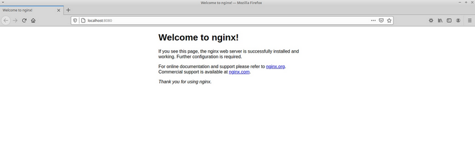
</p>

Remember that each of the publishing rules uses TCP by default. If you need to use UDP, you will have to specify it. For example:

```bash
$ docker run -d -p 5005:5005/udp mendhak/udp-listener
```

Exposing ports
==============

We have seen in the previous sections how to publish ports in Docker. But there is another mechanism in Docker related to ports, which is to expose ports.

You expose ports by using the EXPOSE keyword in the Dockerfile or the --expose flag on the command line. Exposing ports is a way to document which ports are used, but it does not actually assign or open any ports. Port exposure is optional.

So, the first thing to understand is that exposing ports is a documentation mechanism that in principle only informs which ports will be used by the container. According to the Docker documentation: *"It functions as a type of documentation between the person who builds the image and the person who runs the container, about which ports are intended to be published."*

Using EXPOSE in the Dockerfile
------------------------------

If we consult, for example, the Dockerfile of the <a href="https://github.com/nginxinc/docker-nginx/blob/master/Dockerfile-debian.template">official Nginx image</a> we will see that one of its lines includes the following statement:


```bash
EXPOSE 80
```

**TODO**
